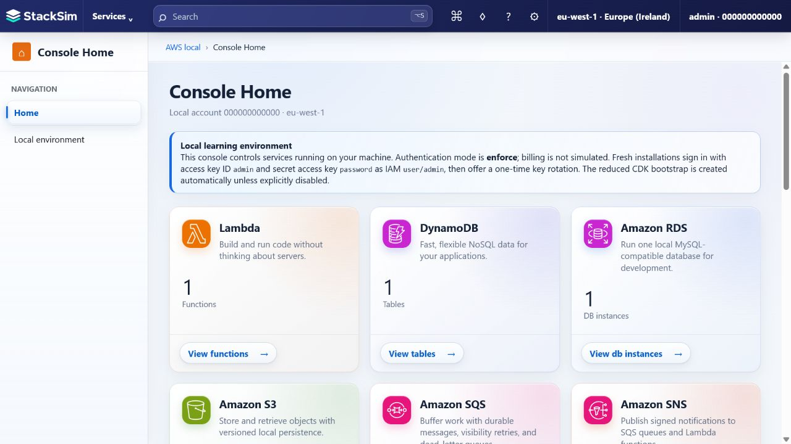

<p align="center">
  
</p>

# StackSim

StackSim simulates selected AWS services on your machine and works with unmodified AWS CDK v2 applications, the AWS CLI, and the AWS SDK for JavaScript v3. It is designed for learning and education, so you can build, deploy, inspect, and reset realistic cloud applications locally without needing an AWS account or incurring cloud costs.

> [!IMPORTANT]
> StackSim is an independent open-source project and is not affiliated with, endorsed by, or sponsored by Amazon Web Services. Amazon Web Services, AWS, and related service names are trademarks of Amazon.com, Inc. or its affiliates. StackSim is intended for local learning and development, not production workloads.

## From clone to console in minutes

You need [Node.js 22.13 or newer](https://nodejs.org/). RDS uses Node's built-in SQLite support, so no separate database installation is required.

### 1. Install

Clone or download StackSim, then run these commands from the repository root:

```bash
npm install
npm run build
```

### 2. Start StackSim

```bash
npm start
```

Leave StackSim running and open a second terminal for the next step.

### 3. Seed the learning environment

In a second terminal window, while StackSim continues running in the first, run:

```bash
npm run seed
```

The seed is idempotent. It creates a ready-to-explore DynamoDB table, AppSync API, Lambda function, API Gateway API, IAM policy, CloudWatch log group, and local RDS learning database.

### 4. Log in to the console

Open [http://127.0.0.1:4566/_stacksim/console](http://127.0.0.1:4566/_stacksim/console) and use:

| Field | Value |
| --- | --- |
| Access key ID | `admin` |
| Secret access key | `password` |
| Session token | Leave blank |

> [!TIP]
> After your first login, you can change the secret access key. To get started, we recommend leaving it as `password`. To reset everything at any time, stop StackSim, delete the `.stacksim` folder in the repository root, and start StackSim again.



## Try it with the AWS CLI

Set the standard AWS environment variables in the terminal where you run the AWS CLI. StackSim needs no wrapper or simulator-specific CLI flags.

To configure these settings once instead of exporting them in every terminal, see the [AWS CLI cookbook](docs/aws-cli-cookbook.md#recipe-2-configure-the-default-stacksim-profile) for instructions on updating your AWS credentials and config files.

<details>
<summary><strong>Bash, zsh, or Git Bash</strong></summary>

```bash
export AWS_ACCESS_KEY_ID=admin
export AWS_SECRET_ACCESS_KEY=password
export AWS_REGION=eu-west-1
export AWS_DEFAULT_REGION=eu-west-1
export AWS_ENDPOINT_URL=http://127.0.0.1:4566

aws dynamodb list-tables
```

</details>

<details>
<summary><strong>PowerShell</strong></summary>

```powershell
$env:AWS_ACCESS_KEY_ID = "admin"
$env:AWS_SECRET_ACCESS_KEY = "password"
$env:AWS_REGION = "eu-west-1"
$env:AWS_DEFAULT_REGION = "eu-west-1"
$env:AWS_ENDPOINT_URL = "http://127.0.0.1:4566"

aws dynamodb list-tables
```

</details>

After running the seed, the response includes the `LearningNotes` table. The same environment works with ordinary CDK v2 applications and AWS SDK clients.

## Supported services

StackSim focuses on useful learning workflows rather than complete AWS parity. Unsupported actions fail with AWS-style errors instead of silently pretending to work.

| Service | Supported learning surface | Not currently supported or intentionally bounded |
| --- | --- | --- |
| AWS CDK and CloudFormation | Unmodified CDK v2 deployments, a reduced automatic bootstrap, file assets, root and nested stacks, hierarchy-aware change sets, updates, rollback, outputs, retention, and deletion across the registered resource types | The full CloudFormation resource catalog, ECR/image assets, every bootstrap topology, transforms/macros, StackSets, and arbitrary custom-resource ecosystems |
| Amazon DynamoDB | All 57 DynamoDB API actions and all four Streams actions: table, item, and batch CRUD; expressions; LSI/GSI indexes; evaluated-item pagination; transactions; TTL; optional deterministic capacity enforcement; tags and resource policies; backups and point-in-time recovery; durable Streams and Lambda polling; DynamoDB-subset PartiQL with exact-get/query/partition-`IN`/scan planning, statement-derived IAM, and singleton/batch/transaction tooling; MREC global tables; contributor insights; Kinesis destination configuration; and opted-in local DynamoDB JSON/GZIP import/export | DAX (a separate service); real Kinesis record delivery; real S3-backed import/export; Ion, CSV, ZSTD, and incremental transfers; KMS integration; MRSC, witnesses, multi-account groups, and replica KMS keys; generic SQL and unsupported PartiQL such as joins, subqueries, aggregates, identifier parameters, multiple statements, and statement-level `LIMIT`; production stream shard splitting/merging; an automatic scaling controller; and AWS distributed throughput or infrastructure |
| AWS Lambda | Local Node.js ZIP and OCI-image functions, versions, aliases, layers, URLs, concurrency, async invocation, and DynamoDB Streams/SQS event sources. Node ZIP execution environments are bounded and warm-reused, including module state, client singletons, private `/tmp`, and truthful initialized provisioned concurrency. | Non-Node managed runtimes, remote ECR publishing, reusable/prewarmed image containers, image-function provisioned concurrency, and AWS-managed runtime, VPC, or compute infrastructure |
| AWS Step Functions | Durable Standard JSONPath Workflows with Lambda, DynamoDB item, SQS send/callback, SNS publish/callback, EventBridge put-events, and nested workflow request/`.sync`/callback integrations; stable task-attempt identity plus owning-service acceptance receipts; Activities and all task-token APIs; retry/catch; restart-safe Parallel, Inline Map, callbacks and workers; execution-role IAM; idempotently correlated EventBridge/Scheduler starts; metrics/events; and console inspection. Receipt payloads remain in private owning stores and terminal receipts are released after workflow completion is durable. | Express, JSONata, versions/aliases/redrive, Distributed Map, AWS SDK integrations, HTTP tasks, cross-account tasks, unlisted optimized integrations, and KMS/X-Ray. An arbitrary synchronous Lambda (or other non-idempotent external side effect) that stops after dispatch but before its owning completion receipt remains explicitly ambiguous and is never retried blindly. |
| Amazon API Gateway | REST, HTTP, and WebSocket APIs; Lambda, DynamoDB, SQS, HTTP, and selected private integrations; auth, stages, domains, logging, metrics, validation, and durable response caching with optional authenticated local encryption | Every AWS service integration, real VPC networking, edge infrastructure, managed certificates, and AWS KMS-backed cache encryption |
| AWS AppSync | API-key GraphQL APIs, schemas, `NONE` and DynamoDB data sources, VTL unit and pipeline resolvers, queries/mutations, `AWS_IAM` request/field authorization, the frozen Amplify Todo CRUD/subscription graph, and console exploration | JavaScript resolvers, Cognito/Lambda/OIDC authorization, enhanced subscription filters/invalidation, Events, caches, merged APIs, custom domains, and the complete AppSync catalog |
| AWS Amplify Gen 2 Data (pinned implementation preview) | Unmodified `ampx` sandbox deployment, normal CLI-written outputs, client CRUD/list/filter/pagination and subscriptions, repeat deploys, supported scalar edits and watch-mode fallback, named deletion/recreation, and two-sandbox isolation for the checked-in Todo backend | General compatibility pending the cross-cutting closeout and full crash-recovery hardening; Amplify Gen 1; other package versions or backend graphs; Auth, Storage, user Functions, relationships, indexes, custom operations, auxiliary generation commands, `pipeline-deploy`, and Hosting |
| Amazon S3 | General-purpose buckets, object I/O, multipart upload, versioning, checksums, policies/ACLs, data governance, lifecycle/archive restore, SQS/Lambda/EventBridge notifications, telemetry, and static websites | Replication, inventory/analytics, access points, directory buckets, Batch Operations, and real KMS |
| Amazon SQS | Standard, fair, and FIFO queues; batching, visibility, long polling, delays, retention, DLQs/redrive, policies, and Lambda triggers | Message-move tasks, KMS, and the complete administrative action catalog |
| Amazon SNS | Standard topics, SQS/Lambda fan-out, filters, raw delivery, retries, DLQs, policies, signatures, metrics, and selected service producers | FIFO topics, external SMS/mobile/email delivery, KMS, and the full SNS administration catalog |
| Amazon EventBridge and Scheduler | Buses, rules, event patterns, input transforms, Lambda/SQS/API Gateway/Logs/Standard Step Functions targets, retries, DLQs, encrypted local archives, selected-rule replay, and schedules with immutable admitted occurrences across update/delete/restart | Pipes, API destinations, Schemas, partner events, customer-managed KMS, and cross-account delivery |
| Amazon CloudWatch | Logs, metrics, alarms, dashboards, metric math, bounded Logs/Metrics Insights, subscriptions, streams, and contributor insights. See the generated [Logs Insights capability manifest](docs/generated/cloudwatch-logs-insights-capabilities.json) for production-level grammar, function, API, log-class, and limit coverage. | The complete Insights query languages and action catalogs, plus AWS-managed telemetry infrastructure |
| AWS IAM and STS | Users, groups, access keys, roles, policies, exact path-qualified authorization targets, SigV4 enforcement, `AssumeRole`, session policies/tags, and caller identity | IAM Identity Center, Organizations, and the complete IAM/STS administration surface |
| Amazon Cognito user pools | Users, groups, password/SRP auth, MFA, remembered-device tracking (`DeviceConfiguration`, `NewDeviceMetadata`, device SRP challenges), triggers, OAuth, local domains, OIDC, SAML, API Gateway authorizers, and eight CloudFormation/CDK user-pool resource types | Cognito identity pools, production federation breadth, unsupported `AWS::Cognito::*` types/properties, and the complete Cognito action catalog |
| Amazon SES | SES v1/v2 sending, identities, templates, configuration sets, quotas, and a durable local inbox | External SMTP delivery, production DKIM/reputation behavior, ISP feedback, and advanced delivery families |
| AWS Systems Manager Parameter Store | Standard/Advanced `String`, `StringList`, and locally protected `SecureString` parameters; selectors; history; hierarchy reads; tags; exact expiration/notification/no-change policies with safe EventBridge events; IAM; dynamic references; and `AWS::SSM::Parameter` | General Systems Manager, KMS `KeyId`, Intelligent-Tiering/account tier settings, sharing, and the full SSM catalog |
| AWS Secrets Manager | Secret lifecycle, encrypted values, stages and rollback, batch reads, configured-account policies, deletion/recovery, IAM, dynamic references, existing permitted non-VPC Lambda rotation, bounded local RDS attachment/managed credentials, and four CloudFormation resource types | Hosted/VPC rotation, arbitrary target services, replication, cross-account policies, customer KMS, and the complete Secrets Manager catalog |
| Amazon RDS local profile | One loopback-only instance with the fail-closed [`mysql8-orm-v1`](docs/rds-mysql8-development-profile.md) subset, pinned Knex/Sequelize coverage, lifecycle, tags, parameters, snapshots/restore, optional Secrets Manager-managed master credentials, and bounded secret rotation/attachment | Prisma/TypeORM or unlisted ORM/version compatibility, PITR/automated backups, Aurora, Multi-AZ, replicas, public networking, customer KMS, other engines, and full MySQL parity |

DynamoDB has no action-level gaps in the current official catalog; its unsupported column records bounded variants and unavailable external infrastructure. See the [action inventory](docs/designs/dynamodb-action-inventory.md) for exact operation ownership and the [PartiQL conformance manifest](docs/generated/dynamodb-partiql-conformance.json) for the supported grammar, request fields, limits, IAM context, and deliberate local differences.

## Showcase examples

Each showcase deploys through ordinary tools and is intended to be read, changed, broken, and rebuilt while you learn.

| Example | What it does | What you can learn by analysing it |
| --- | --- | --- |
| [Amplify Todo](examples/amplify-todo/README.md) | Deploys a checked-in, pinned Amplify Gen 2 Data backend and runs its public realtime Todo model with `ampx` and React. | Code-first Data resources, sandbox lifecycle, generated outputs, AppSync/DynamoDB data flow, subscriptions, supported backend edits, and locating generated resources through CloudFormation. |
| [OrderFlow Observatory](examples/cdk-orderflow-observatory/README.md) | Launches deterministic orders through a CDK Standard Workflow and visualises live state transitions, retries, parallel checks, waits, inline item maps, compensation, history, input, and output in React. | Step Functions control flow and JSONPath context, Lambda tasks, retry/catch semantics, Parallel and Inline Map, execution inspection, IAM execution roles, CDK synthesis, and S3-hosted React integration. |
| [Aurora Atlas](examples/cdk-full-stack-showcase/README.md) | Deploys a React signal observatory across three CDK stacks, then follows data from API Gateway and DynamoDB through Streams, EventBridge, Lambda, SQS, a DLQ, and a second table. | Multi-stack CDK design, API validation/auth, event-driven pipelines, retries and dead-letter handling, S3 website deployment, outputs, updates, and deletion. |
| [S3 Lambda Notification Audit](examples/cdk-s3-lambda-notification-audit/README.md) | Deploys an empty versioned S3 bucket and records its direct Lambda event notifications in a DynamoDB audit table, with no UI. | Native S3 notification configuration, Lambda resource permissions and event handling, preserving unfamiliar event payloads, DynamoDB audit records, and CDK deployment. |
| [Signal Relay](examples/cdk-sns-routing-lab/README.md) | Publishes an incident once and visualises how SNS filters and fans it out to three Lambda subscribers and an SQS queue. | SNS attribute/body filters, fan-out, raw versus enveloped delivery, resource policies, least privilege, retries, DLQs, and CDK-generated infrastructure. |
| [Sprint Planner](examples/cdk-sprint-planner/README.md) | Builds a collaborative Jira-style application with HTTP and WebSocket APIs, DynamoDB, Lambda, EventBridge, SQS, SES, CloudWatch, IAM, a stack-owned Cognito user pool, and a versioned S3 site. | Larger application boundaries, real-time updates, async notification workflows, CDK-managed identity, conflict-safe operations, and multi-service observability. |
| [Team Bug Triage Board](examples/cdk-appsync-bug-tracker/README.md) | Deploys a responsive Kanban application with an AppSync GraphQL API, DynamoDB data sources and indexes, VTL unit resolvers, IAM, and an S3 website. | GraphQL schema design, AppSync-to-DynamoDB mapping templates, CDK resource relationships, API-key boundaries, indexed queries, and testing through the deployed API. |
| [Paper Badge](examples/cognito-saml-idp/README.md) | Runs a small local SAML identity provider and completes a Cognito OAuth authorization-code flow with PKCE and signed assertions. | SAML SP/IdP roles, OAuth redirects and tokens, assertion signing, attribute mapping, and why a learning identity provider is not production security infrastructure. |
| [RDS Stream projection](examples/rds-stream/deploy.ts) | Projects DynamoDB Stream inserts, updates, and deletes through Lambda into a local SQL inventory table. | Event-source mappings, `NEW_AND_OLD_IMAGES`, idempotent projections, retry-safe handlers, and the differences between source state and materialised views. |

## Documentation

| Guide | What it covers |
| --- | --- |
| [AWS CLI cookbook](docs/aws-cli-cookbook.md) | Installation and local profile setup, followed by practical AWS CLI recipes for every StackSim-supported service family. |
| [Developer guide](docs/developer-guide.md) | A hands-on TypeScript walkthrough for creating, deploying, and testing a CDK notes API backed by Lambda and DynamoDB. |
| [Amplify Todo guide](examples/amplify-todo/README.md) | End-to-end setup for the pinned Amplify Gen 2 Data example, including deployment, watch mode, deletion, local TLS, inspection, and troubleshooting. |
| [Amplify compatibility design](docs/designs/amplify-design.md) | Evidence-backed requirements, implemented boundaries, verification gates, and planned Amplify Gen 2 capability slices. |
| [Detailed implementation reference](docs/reference.md) | Complete implementation notes, service examples, SDK usage, endpoints, persistence, authentication, configuration, scope, and project layout. |

### Console guides

Panel-by-panel references for every StackSim service console (what each setting does, AWS use cases, and local boundaries).

| Guide | What it covers |
| --- | --- |
| [API Gateway](docs/apigateway-console-guide.md) | REST, HTTP, and WebSocket APIs, stages, integrations, authorizers, keys, and domains |
| [AppSync](docs/appsync-console-guide.md) | GraphQL APIs, schema, VTL resolvers, DynamoDB data sources, API keys, and queries |
| [CloudFormation](docs/cloudformation-console-guide.md) | Stacks, change sets, exports, events, and local CDK setup |
| [CloudWatch](docs/cloudwatch-console-guide.md) | Metrics, alarms, dashboards, log groups, Logs Insights, and Contributor Insights |
| [Cognito](docs/cognito-console-guide.md) | User pools, app clients, hosted UI, and triggers |
| [DynamoDB](docs/dynamodb-console-guide.md) | Tables, items, streams, backups, PartiQL, and global tables |
| [EventBridge](docs/eventbridge-console-guide.md) | Event buses, rules, Sandbox, and Scheduler |
| [IAM](docs/iam-console-guide.md) | Users, groups, roles, policies, and authorization decisions |
| [Lambda](docs/lambda-console-guide.md) | Functions, layers, capacity providers, triggers, and configuration |
| [Parameter Store](docs/parameter-store-console-guide.md) | Parameters, hierarchies, and SecureString values |
| [RDS](docs/rds-console-guide.md) | DB instances, query editor, and parameter groups |
| [S3](docs/s3-console-guide.md) | Buckets, objects, versioning, notifications, and policies |
| [Secrets Manager](docs/secrets-manager-console-guide.md) | Secrets, versions, and recovery window |
| [SES](docs/ses-console-guide.md) | Identities, Inbox, templates, configuration sets, and suppression |
| [SNS](docs/sns-console-guide.md) | Topics, subscriptions, publish, filters, and delivery diagnostics |
| [SQS](docs/sqs-console-guide.md) | Queues, messages, DLQ, policies, encryption, and Lambda triggers |
| [Step Functions](docs/step-functions-console-guide.md) | State machines, executions, visual ASL editor, and JSON editing |
