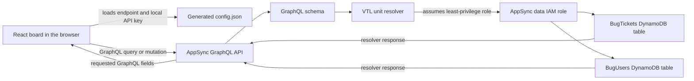
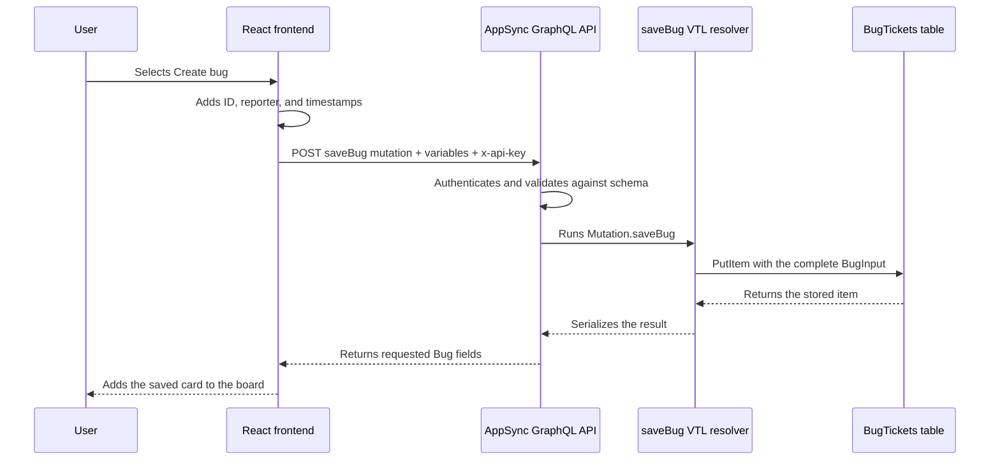

# Team Bug Triage Board guide

This guide is a hands-on tour of the Team Bug Triage Board. It explains how to
use the application, follows one bug from the browser into DynamoDB, and shows
why AppSync is a useful API layer for this kind of workflow.

For installation, environment variables, deployment, and troubleshooting, see
the [README](README.md). This guide starts after `npm run deploy` has completed
and the deployment command has printed the website URL.

## What the application demonstrates

The application is a small issue-tracking workspace with two views:

- **Board** groups bugs into Backlog, Triage, In progress, Ready, and Resolved.
- **Workload** summarizes unresolved assignments for each team member.

From the browser you can:

- create, edit, delete, resolve, and reopen bugs;
- assign bugs and change their severity, component, and environment;
- move cards by dragging them or by using the status selector on each card;
- search and filter the board;
- inspect team workload;
- refresh on demand; and
- enable visibly labelled 15-second polling.

Every saved change goes through the deployed GraphQL API. The browser does not
write directly to DynamoDB.

## Application architecture

AWS CDK defines this infrastructure in `app.ts`. CloudFormation deploys one
GraphQL API, its schema and API key, two DynamoDB data sources, nine unit
resolvers, two DynamoDB tables, the AppSync data role, and the S3-hosted React
website.

The data model is deliberately small:

| Resource | Primary key | Purpose |
| --- | --- | --- |
| `BugTickets` | `id` | Stores the complete bug records |
| `BugUsers` | `id` | Stores the selectable team members |
| `by-status` index | `status`, then `updatedAt` | Queries the newest bugs in one workflow state |
| `by-assignee` index | `assigneeId`, then `updatedAt` | Queries a person's assigned bugs |

The browser currently loads all bugs and users with paginated `listBugs` and
`listUsers` queries, then calculates the visible board, filters, and workload
locally. The indexed GraphQL queries are also deployed and verified by the
smoke test, making them available to clients that need targeted reads.

## First look at the interface

Open the website URL printed by `npm run deploy`.

The top bar contains:

- **Board** and **Workload** view selectors;
- **Poll 15s**, which periodically reloads bugs and users;
- **Refresh**, which reloads them immediately; and
- **New bug**, which opens the creation form.

The board has five status columns. Select a card to open its detail drawer. You
can move it by dragging it to another column or by changing the status selector
on the card. Both methods save the complete changed bug through AppSync.

The filters are applied in the browser to the records already loaded from the
API. Search matches the ID, title, or description. The other controls filter by
assignee, severity, component, or environment.

## Walkthrough: create a bug

Use this sample report to follow a complete request:

1. Select **New bug**.
2. Enter the following values:

   | Field | Example value |
   | --- | --- |
   | Title | `Invoice download returns an empty PDF` |
   | Description | `Invoices created after a refund download as a zero-byte PDF.` |
   | Status | `Triage` |
   | Severity | `High` |
   | Component | `Billing` |
   | Environment | `Production` |
   | Assignee | `Maya Chen · Platform` |

3. Select **Create bug**.
4. Find the new card in the Triage column. With only the seeded records present,
   it will be `BUG-113`; the exact number may be higher if other bugs exist.
5. Open the card, change a field, and select **Save changes** to exercise the
   same mutation as an update.

### What happens behind the scenes

The detailed path is:

1. **The browser completes the record.** The form supplies the editable fields.
   React generates the next `BUG-nnn` ID from the bugs it has loaded, sets the
   reporter to `USR-006` (Sam Okafor), and adds ISO `createdAt` and `updatedAt`
   timestamps. Empty optional fields, such as an unselected assignee, are
   omitted.

2. **The frontend sends one GraphQL mutation.** `frontend/src/api.js` sends an
   HTTP `POST` to the deployed GraphQL endpoint. The JSON request contains the
   `saveBug(input: $input)` mutation and the completed bug as variables. The
   local demonstration API key is sent in the `x-api-key` header.

3. **AppSync authenticates the request.** The API checks the development API
   key before allowing GraphQL execution. The deployment script placed the
   endpoint and key in the generated website `config.json`; the frontend loads
   it with `cache: "no-store"` and keeps it in page memory.

4. **The schema validates the GraphQL shape.** Required fields must be present,
   dates must be valid `AWSDateTime` values, and `status` and `severity` must be
   members of their GraphQL enums. A malformed request fails before reaching
   DynamoDB.

5. **AppSync selects the resolver.** `Mutation.saveBug` is connected to the
   `BugTickets` DynamoDB data source through a VTL `UNIT` resolver. No Lambda
   function or custom REST controller runs in this path.

6. **The resolver builds a DynamoDB operation.** Its mapping template turns the
   GraphQL `BugInput` into a `PutItem`: `id` becomes the table key and the full
   input becomes the stored attributes.

7. **AppSync uses its data role.** The data source uses an IAM role trusted by
   `appsync.amazonaws.com`. Its policy permits only the required DynamoDB
   actions on the two application tables and the two ticket indexes.

8. **DynamoDB stores the bug.** The new item becomes available by ID. Its status
   and assignee attributes also make it available through the corresponding
   global secondary indexes.

9. **The result returns through GraphQL.** The resolver serializes DynamoDB's
   result. AppSync returns only the bug fields requested by the mutation. React
   inserts that returned record into its local state and closes the form.

Creation and editing intentionally share `saveBug`. Because the resolver uses
`PutItem`, saving an existing ID replaces that item's complete stored value.
The frontend therefore sends the whole bug for edits and status moves rather
than sending a partial patch.

## What happens when a bug moves

Drag the new bug from Triage to In progress, or use its status selector.

React starts from the full bug it already has, changes `status`, refreshes
`updatedAt`, and calls `saveBug` again. Moving to Resolved also sets
`resolvedAt`; moving away from Resolved removes it. DynamoDB updates the item
and its index entries as part of the write, and the returned record replaces
the old card in React state.

Another open browser does not receive that move automatically. It sees the
change after **Refresh** or on the next enabled polling interval. Realtime
GraphQL subscriptions are deliberately outside this local example.

## Editing and deleting

Select any card to open the detail drawer.

- **Save changes** preserves the original ID, reporter, and creation time,
  updates the modification time, and sends the complete bug to `saveBug`.
- **Delete** asks for confirmation and calls the `deleteBug(id: ID!)` mutation.
  Its resolver maps directly to DynamoDB `DeleteItem`. The frontend removes the
  card from local state after the mutation succeeds.

Errors returned by HTTP or GraphQL are shown in the banner above the board. The
frontend changes its local data only after the API operation succeeds.

## Why AppSync suits this workflow

AppSync is valuable here because the application is fundamentally a structured
data API with several clients and predictable access patterns.

### One typed contract

The GraphQL schema defines bugs, users, enums, queries, mutations, required
inputs, and returned types in one place. The browser can ask for exactly the
fields it needs, while invalid enum values and missing required inputs are
rejected consistently at the API boundary.

### Direct data-source integration

Straightforward CRUD and indexed queries can map directly to DynamoDB. Removing
a Lambda function from these simple request paths means less application code,
packaging, deployment, and runtime behavior to maintain. Lambda remains useful
when a workflow needs domain logic or integrations that do not belong in a
resolver.

### Centralized authorization

Clients talk to AppSync rather than receiving DynamoDB credentials. AppSync
access and its data-source role are separate controls: the client must first be
allowed to call GraphQL, and the service role limits what AppSync can do in
DynamoDB. This example uses an intentionally public local-development API key;
a production application would normally use a user-aware authorization mode.

### Multiple access patterns behind one endpoint

The same API exposes item lookup, paginated lists, status queries, assignee
queries, saves, and deletes. DynamoDB indexes support efficient targeted reads,
while callers see GraphQL operations instead of table and index details.

### A stable boundary for different clients

A web board, mobile client, command-line tool, or automation can use the same
schema. Each can select a different response shape without adding a separate
REST endpoint for every screen.

### Infrastructure as code

The API, schema, resolvers, tables, indexes, permissions, and website are all
declared in CDK. The example can be synthesized, reviewed, deployed, smoke
tested, and destroyed as one repeatable unit.

In AWS, AppSync also offers managed operational and realtime capabilities. This
StackSim example intentionally stays within its documented local boundary and
does not imply that every AWS AppSync feature is implemented here.

## Production changes to consider

This is a learning application, not a production architecture. Before adapting
the pattern for a real issue tracker, consider:

- replace the browser API key with Cognito, OIDC, or another appropriate
  user-aware authorization design;
- derive the reporter from the authenticated identity rather than hard-coding
  `USR-006`;
- generate collision-resistant IDs on a trusted boundary instead of calculating
  the next visible number in the browser;
- add authorization rules for who may create, assign, resolve, and delete bugs;
- use conditional writes or versioning to prevent one editor from silently
  overwriting another editor's change;
- add server-side business validation and audit history;
- use subscriptions if immediate multi-user updates are required;
- configure production logging, tracing, alarms, backups, retention, and
  recovery; and
- avoid returning secrets through deployment outputs or public website assets.

## Further experiments

After completing the walkthrough, try these exercises:

1. Move the example bug to Resolved and observe its `resolvedAt` value in the
   detail drawer.
2. Switch to Workload and verify that resolved bugs are not counted as open.
3. Open the application in two browser windows. Create or move a bug in one,
   then compare manual refresh with 15-second polling in the other.
4. Run `npm run smoke` and inspect how it verifies GraphQL pagination, both
   indexes, save/delete behavior, authoritative DynamoDB counts, and the hosted
   website.
5. Use the curl or Postman examples in the README to query `bugsByStatus`
   directly and request a smaller selection of fields.

