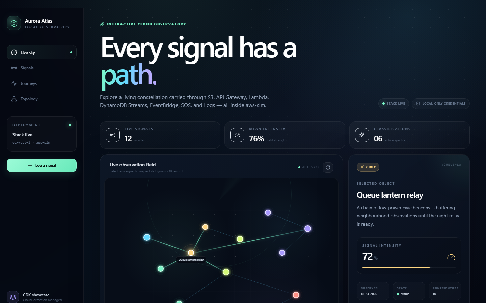

# Aurora Atlas showcase guide

Aurora Atlas demonstrates several StackSim services working together in a full-stack application provisioned with standard AWS CDK constructs. React is hosted as an S3 website, API Gateway and Lambda persist signals in DynamoDB, and **Signal Journey** makes every asynchronous hop through EventBridge and SQS visible.



## What the application does

Aurora Atlas presents observations as a connected field of glowing signals. Each signal has a title, field note, classification, intensity, status, contributor count, and fixed position in the visual atlas.

You can:

- explore the live constellation and select a signal for details;
- search or filter signals by classification;
- add a new observation;
- boost a signal's intensity and contributor count;
- archive a signal;
- restore the deterministic demonstration dataset; and
- follow creates, boosts, updates, and archives from the DynamoDB stream through EventBridge and SQS;
- inject one controlled worker fault and watch its retries, quarantine state, and DLQ depth; and
- run a protected full-stack flight check that confirms the deployed service path.

No sign-in is required. The application contains a fixed local demonstration API key and bearer token so API Gateway's key, usage-plan, and Lambda-authorizer behavior can be shown without Cognito. These values are demonstration mechanics, not production authentication or secrets.

### Example: add a signal

This walkthrough adds an observation and follows it through the application:

1. Open the deployed Aurora Atlas website and select **Log a signal**. The React application and its assets are being served from the S3 website provisioned by CDK.
2. Enter a name such as **Harbour water glow**, add a field note, select **Oceans**, and choose an intensity. At this point the details exist only in the browser.
3. Select **Add to atlas**. The browser sends a cross-origin `POST /signals` request containing the observation, the demonstration API key, and the bearer token.
4. API Gateway checks the API key and usage plan, runs the Lambda authorizer, and validates the request body against the configured model. If any check fails, the request stops here and the application shows an error.
5. API Gateway invokes the application Lambda through its `live` alias. The function assigns the signal an ID, position, timestamp, initial `new` status, and correlation ID, then writes it to the DynamoDB signals table using its IAM execution role.
6. The successful response returns the new signal to the browser, where it appears in the observation field and signal catalog. The API request is complete, but the asynchronous Signal Journey is just beginning.
7. The DynamoDB insert produces a stream record. The publisher Lambda converts it into a `created` event with the same signal and correlation IDs, then publishes that event to the custom EventBridge bus.
8. The EventBridge rule invokes the relay Lambda, which places the event on the SQS work queue. The worker Lambda consumes the message and writes a `processed` entry to the DynamoDB journey-activity table.
9. Open **Signal Journey** to watch the result appear. The browser polls `GET /journeys`, so the new activity may arrive a moment after the signal itself. Structured entries from the application, publisher, relay, and worker Lambdas are also written to CloudWatch Logs.

Every infrastructure component in this path is defined by the example's CDK stacks and deployed through StackSim.

## How the services work together

```text
React + Tailwind in the browser
        |
        |  HTML, JavaScript and CSS
        v
S3 website + public-read bucket policy
        |
        |  Cross-origin REST requests
        v
API Gateway REST API
  |-- CORS preflight methods
  |-- API key and usage plan
  |-- request models and validation
  |-- Lambda token authorizer
  |-- gateway error responses
        |
        |  AWS_PROXY invocation
        v
Lambda `live` alias -> immutable Lambda version
        |                         |
        | read/write              | structured logs
        v                         v
DynamoDB signals table       CloudWatch Logs
  |-- category GSI
  |-- TTL
  `-- NEW_AND_OLD_IMAGES stream
                |
                v
        publisher Lambda
                |
                v
        EventBridge custom bus
        + Lambda-target rule
                |
                v
          relay Lambda
                |
                v
      SQS work queue + redrive DLQ
                |
                v
          worker Lambda
                |
                v
      DynamoDB journey activity table
```

IAM roles and policies surround the request path. They allow each Lambda function and the deployment helper to perform only the operations needed for this showcase.

## Service-by-service explanation

### AWS CloudFormation and CDK

The example is an ordinary AWS CDK v2 TypeScript project. It uses standard constructs from `aws-cdk-lib`; there are no stacksim-specific CDK constructs.

The application is separated into three stacks:

| Stack | Purpose |
| --- | --- |
| `AuroraAtlasDataStack` | Owns the signal and journey-activity DynamoDB tables. |
| `AuroraAtlasApiStack` | Owns IAM, Lambda, CloudWatch Logs, API Gateway, EventBridge, and SQS. |
| `AuroraAtlasWebStack` | Owns the S3 website and React asset deployment. |

`AWS::CDK::Metadata` is emitted by CDK in each stack. Cross-stack references allow the API stack to use the table created by the data stack while preserving CloudFormation dependency and export/import behavior.

### Amazon S3

S3 hosts the compiled React application as a public website.

- The website bucket is versioned.
- Objects use S3-managed `AES256` encryption.
- ACL-based public access is blocked.
- A narrowly scoped bucket policy permits anonymous `s3:GetObject` access to website objects.
- The index document is `index.html`.
- All application asset paths are relative because stacksim uses a path-based website URL.

The standard CDK `BucketDeployment` construct uploads and prunes the React build. CDK also provisions the deployment helper and its supporting resources:

- `AWS::Lambda::LayerVersion` for the helper's AWS CLI layer;
- `AWS::Lambda::Function` for the deployment helper;
- `AWS::IAM::Role` and `AWS::IAM::Policy` for helper permissions; and
- `Custom::CDKBucketDeployment` for the bounded deployment operation.

### Amazon API Gateway

API Gateway exposes the application REST surface at the simulator's invocation listener:

```text
http://127.0.0.1:4567/{ApiId}/prod
```

The API contains:

| Route | Protection | Purpose |
| --- | --- | --- |
| `GET /signals` | Public | Load all signals for the atlas. |
| `GET /signals/{id}` | Public | Load one signal. |
| `POST /signals` | API key + token authorizer + body validation | Create a signal. |
| `PUT /signals/{id}` | API key + token authorizer | Boost or update a signal. |
| `DELETE /signals/{id}` | API key + token authorizer | Archive a signal. |
| `GET /journeys` | Public | Read recent journey activity plus queue, retry, quarantine, and DLQ counts. |
| `POST /journeys/fault` | API key + token authorizer | Inject one controlled poison signal for the retry/redrive demonstration. |
| `POST /demo/seed` | API key + token authorizer + body validation | Seed or reset demo data. |
| `GET /system/proof` | API key + token authorizer | Verify the complete deployed service path. |

The CDK stacks provision the REST API, resources, methods, deployment, stage, account integration, authorizer, models, request validator, gateway response, API key, usage plan, and usage-plan key.

CORS `OPTIONS` methods allow the S3 website on port `4566` to call the API on port `4567`. Lambda proxy responses also return the required CORS headers.

### AWS Lambda

Five application functions are deployed:

- **Application Lambda** implements listing, creation, updates, archival, deterministic seeding, and the system proof response.
- **Authorizer Lambda** accepts the fixed local bearer token and returns an API Gateway IAM policy.
- **Journey publisher Lambda** normalizes DynamoDB stream records into stable event envelopes.
- **Journey relay Lambda** is the supported EventBridge rule's Lambda target and sends matched events to SQS.
- **Journey worker Lambda** consumes SQS batches and writes processed, retrying, or quarantined activity.

The application Lambda publishes an immutable version. API Gateway invokes the stable `live` alias, so future code deployments can publish a new version and advance the alias without changing the API integration identity.

The Lambda functions use the Node.js 22 runtime. Their asset folders explicitly declare CommonJS module mode so they run consistently whether the simulator data directory is inside or outside this ESM repository.

### Amazon DynamoDB

DynamoDB stores both the signals displayed by the application and the activity read by Signal Journey.

- **Signals table:** partition key `id`, on-demand billing, `byCategory` GSI, TTL, and `NEW_AND_OLD_IMAGES` stream.
- **Journey activity table:** partition key `journeyId`, sort key `activityId`, on-demand billing, and TTL.

Twelve deterministic records are seeded during `npm run deploy`. The versioned seed inserts missing records and migrates older demo records to the journey envelope while preserving user-created signals.

The **Reset demo** button behaves differently: it deletes every current signal, including user-created signals, and then restores the twelve deterministic records. Those deletes and inserts are genuine stream events, so their journeys remain observable.

### Amazon EventBridge

The stream publisher emits a versioned envelope with a stable event ID, signal ID, correlation ID, action, timestamp, and signal snapshot to the custom `aurora-atlas-signal-journey` bus. A rule matches the `aurora.atlas` source and `Signal Journey` detail type.

Atlas targets the journey relay Lambda, which forwards the event to SQS. This intentional extra hop keeps the event path visible and gives the relay a focused responsibility.

### Amazon SQS

The Standard work queue buffers matched events for the journey worker. It uses:

- SQS-managed server-side encryption;
- a three-second visibility timeout;
- partial Lambda batch-failure reporting;
- a redrive policy with three receives; and
- a separate 14-day dead-letter queue.

Normal activity is acknowledged after it is projected into DynamoDB. A controlled fault records attempts one and two as `retrying`, records attempt three as `quarantined`, and is then moved by the queue's redrive policy. The `/journeys` response and UI expose visible, in-flight, delayed, and dead-letter counts.

### AWS IAM

IAM resources connect the services without placing AWS credentials in the browser.

- Lambda execution roles establish the Lambda trust relationship.
- An inline IAM policy grants the application Lambda table access.
- An explicit managed policy demonstrates managed-policy creation and attachment.
- API Gateway receives its standard CloudWatch role.
- The bucket-deployment helper receives source-read and destination-write permissions.

The browser receives only the API invocation URL and fixed demo API credentials. It never receives the stacksim control-plane credentials or endpoint.

### Amazon CloudWatch Logs

Explicit log groups with one-week retention receive structured events from the application, publisher, relay, and worker Lambdas. Lambda also records standard start, end, report, and request-correlation entries. The system flight check includes Logs in its eight-service proof.

## How to use Aurora Atlas

### Explore the live sky

1. Open the website URL printed by `npm run deploy`.
2. Select any glowing node in **Live observation field**.
3. Read its field note, intensity, state, observation date, and contributor count in the detail panel.
4. Use the classification chips or search box in **Signal catalog** to narrow the collection.

### Add a signal

1. Select **Log a signal**. On a phone, use the `+` button in the top bar.
2. Enter a name and a descriptive field note.
3. Select Oceans, Space, Energy, Climate, Robotics, or Civic.
4. Adjust the intensity slider.
5. Select **Add to atlas**.

The browser sends the API key and bearer token automatically. API Gateway validates the payload before Lambda writes it to DynamoDB.

### Boost or archive a signal

1. Select a signal.
2. Select **Boost** to add four intensity points, up to 100, and increment its contributor count.
3. Select **Archive** to delete that signal from DynamoDB and remove it from the atlas.

Archive is a real deletion, not a visual-only hide operation. Use **Reset demo** if you want to restore an archived deterministic demo signal.

### Follow a Signal Journey

1. Create, boost, update, archive, or reset a signal.
2. Open **Signal Journey**.
3. Find the signal by title or correlation ID.
4. Follow the displayed path: DynamoDB stream → publisher → EventBridge → relay → SQS → worker → activity table.
5. Watch queue-depth and processed counters settle as the asynchronous worker catches up.

The browser polls the public `GET /journeys` route, so no control-plane credentials are exposed.

### Demonstrate retry and redrive

1. In **Signal Journey**, select **Inject relay fault**.
2. Watch the controlled event progress through retry attempts.
3. After the third failed receive, confirm its `quarantined` state and the increased DLQ count.

This is an application-owned fault marker, not a random outage. Other messages in the same batch can still succeed because the worker returns SQS partial batch failures.

### Run the full-stack flight check

1. Scroll to **One request. The whole local cloud.**
2. Select **Run flight check**.
3. The application calls protected `GET /system/proof`.
4. Successful cards confirm S3, API Gateway, Lambda, IAM, DynamoDB, EventBridge, SQS, and CloudWatch Logs, along with the current Lambda release.

### Reset the demonstration

Select **Reset demo** above the signal catalog to restore the original twelve records. This removes all current signals first, including observations you created yourself.

## Install and run the showcase

From the StackSim repository root, install dependencies and build:

```powershell
npm install
npm run build
```

Start a persistent simulator in one terminal:

```powershell
Remove-Item Env:STACKSIM_DATA_DIR -ErrorAction SilentlyContinue
npm start
```

Leaving `STACKSIM_DATA_DIR` unset uses the checkout's persistent `.stacksim` state. That is the deployment target used by this guide, so a later ordinary `npm start` reopens the Atlas stacks. Do not run `cdk bootstrap` against stacksim; the reduced local bootstrap is created and managed automatically.

In another terminal, start from the repository root, then install and deploy the example:

```powershell
Set-Location .\examples\cdk-full-stack-showcase
npm install

$env:AWS_ACCESS_KEY_ID = "admin"
$env:AWS_SECRET_ACCESS_KEY = "password"
$env:AWS_REGION = "eu-west-1"
$env:AWS_DEFAULT_REGION = "eu-west-1"
$env:AWS_ENDPOINT_URL = "http://127.0.0.1:4566"
$env:STACKSIM_INVOKE_ENDPOINT = "http://127.0.0.1:4567"
$env:CDK_DEFAULT_ACCOUNT = "000000000000"
$env:CDK_DEFAULT_REGION = "eu-west-1"

npm run deploy
```

The deployment command:

1. verifies that StackSim is healthy;
2. synthesizes the three CDK stacks;
3. verifies the synthesized assembly;
4. deploys the data and API stacks;
5. derives the real local API identity;
6. seeds DynamoDB through the protected API;
7. rebuilds React with the derived API URL;
8. deploys the S3 website; and
9. runs an end-to-end smoke test.

The website URL is printed at the end and stored in `.runtime/deployment.json` as `websiteUrl`.

## Useful project commands

| Command | Purpose |
| --- | --- |
| `npm run build` | Build React, synthesize CDK, and verify the showcase assembly. |
| `npm run synth` | Synthesize all three stacks without deploying. |
| `npm run verify:assembly` | Verify the synthesized showcase resources. |
| `npm run deploy` | Deploy, seed, configure the frontend, and run smoke tests. |
| `npm run smoke` | Recheck the deployed website, API, seed data, protected proof, and CORS. |
| `npm run capture` | Capture verified desktop and mobile screenshots from the deployed website. |

## CDK provisioning boundary

The showcase infrastructure is defined with standard CDK constructs and deployed through StackSim's CloudFormation implementation. The EventBridge rule targets a relay Lambda before SQS as part of the application's visible event journey.

DynamoDB items are runtime data rather than stack resources. `npm run deploy` therefore performs its versioned, idempotent seed through the already-deployed protected API.

## Real AWS portability

The stacks use standard CDK constructs and can form the basis of a real AWS deployment. The included `npm run deploy` workflow is intentionally stacksim-specific, however: it checks the simulator health endpoint and derives the local invocation URL.

A real AWS workflow must bootstrap the target account, use the real API Gateway output when building React, and reconsider the public S3 website plus embedded demo credentials. Production deployments would normally add genuine identity, TLS/CloudFront, stricter data retention, monitoring, and account-specific security controls.
