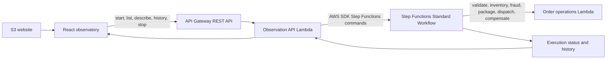
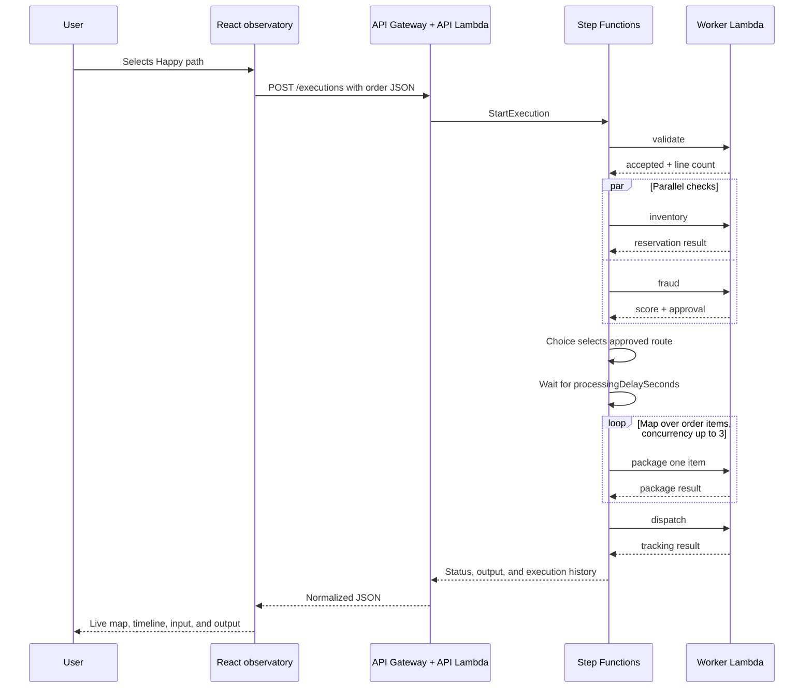

# OrderFlow Observatory guide

This guide is a hands-on tour of OrderFlow Observatory. It explains how to run
and inspect an order, how each built-in scenario changes the state-machine
route, and how AWS Step Functions coordinates the work behind the scenes.

For installation, environment variables, deployment, and cleanup, see the
[README](README.md). This guide starts after `npm run deploy` has completed and
printed the website URL.

## What the application demonstrates

OrderFlow is an execution observatory rather than a conventional order-entry
screen. Each button starts a real Step Functions Standard Workflow execution
with deterministic input. The interface then reads the execution status and
history and turns them into a live workflow map.

The example demonstrates:

- sequential Lambda task orchestration;
- parallel inventory and fraud checks;
- targeted retry with exponential backoff;
- data-based branching;
- a durable processing wait;
- concurrent per-item processing with an inline Map;
- catch and compensation paths;
- successful, failed, and operator-stopped executions; and
- durable execution input, output, status, and history.

## Architecture



There are two Lambdas with deliberately different responsibilities:

- The **observation API Lambda** translates REST requests into ordinary Step
  Functions SDK commands such as `StartExecution`, `DescribeExecution`,
  `GetExecutionHistory`, `ListExecutions`, and `StopExecution`.
- The **workflow worker Lambda** performs deterministic order operations. Step
  Functions invokes the same worker with a different `operation` value for
  validation, inventory, fraud, packaging, dispatch, or compensation.

Step Functions owns the control flow. Neither Lambda contains the overall
workflow or manually calls the next Lambda operation.

## Understanding the screen

The application is organized into three numbered areas.

### 1. Launch

**Choose a workflow story** contains five prepared scenarios. Selecting one
adds a short suffix to its order ID and starts a new execution, so the same
scenario can be run repeatedly without execution-name collisions.

Select **Custom input** to edit the complete JSON order and start your own run.

### 2. Select

**Executions** lists recent runs and their current status. Select a run to load
its details. The refresh button reloads the list, although the selected run is
also polled automatically while the application is open.

### 3. Observe

The center workspace colors states as they run, succeed, or fail. It exposes
the parallel branches, the fraud rejection route, Map concurrency, and the
shared compensation route.

The inspector on the right has three tabs:

- **Timeline** shows important state-entry, Lambda scheduling, task-failure,
  and execution events.
- **Input** shows the immutable JSON supplied when the execution started.
- **Output** shows the final workflow data, or the error and cause for an
  unsuccessful execution.

A running execution also displays **Stop**. Stopping records the execution as
`ABORTED` with the application-defined `OperatorStopped` reason.

## Walkthrough: follow a successful order

1. Open the website URL printed by `npm run deploy`.
2. Select **Happy path**.
3. Watch **Validate order** and **Mark order accepted** complete.
4. Observe **Reserve inventory** and **Assess fraud** run as parallel branches.
5. Follow the approved route through **Processing window**.
6. Watch the three order items enter **Package item** through the inline Map.
7. Observe **Dispatch order** and the terminal **Order complete** state.
8. Open the **Input**, **Timeline**, and **Output** inspector tabs.

The input is based on this order:

```json
{
  "orderId": "OF-2048",
  "customer": "Avery Stone",
  "processingDelaySeconds": 1,
  "fraudScore": 18,
  "transientFailures": 0,
  "failInventory": false,
  "failItem": "",
  "items": [
    { "sku": "SKU-LAMP", "quantity": 1 },
    { "sku": "SKU-BOLT", "quantity": 2 },
    { "sku": "SKU-MUG", "quantity": 1 }
  ]
}
```

The browser adds a small suffix to `orderId` before starting the run. The API
Lambda also generates a unique Step Functions execution name.

## What happens behind the scenes



### Validate order: Task

The first `LambdaInvoke` task calls the worker with `operation: "validate"` and
the complete order. The worker checks that the order has an ID, customer, and
at least one item, and that every item has a SKU and positive integer quantity.

Step Functions uses a result selector and result path to store only the
validation result under `$.validation`, preserving the rest of the order data.

### Mark order accepted: Pass

The Pass state adds an admission marker at `$.admission` without running code.
Pass states are useful for reshaping or annotating workflow data when a Lambda
invocation would add unnecessary cost and complexity.

### Run checks in parallel: Parallel

The Parallel state starts two independent branches:

- **Reserve inventory** calls the worker's inventory operation.
- **Assess fraud** calculates a bounded score and approval decision.

The workflow waits until both branches finish. Their results become an array at
`$.checks`: inventory is the first result and fraud is the second. Running
independent work concurrently reduces the critical-path duration and makes the
fan-out/fan-in relationship explicit.

### Reserve inventory: Task with Retry

The inventory task passes `$$.State.RetryCount` to the worker. That Step
Functions context value starts at zero and changes on retries, allowing the
demo worker to fail a configured number of early attempts deterministically.

Only `InventoryTransientError` is retried. The policy starts with a one-second
interval, uses a backoff rate of two, and has a bounded attempt count. Permanent
`InventoryUnavailable` errors are not retried and go to the Parallel state's
catch path.

This is an important Step Functions benefit: retry policy belongs to the
workflow definition instead of being duplicated inside application code.

### Fraud approved?: Choice and Fail

The Choice state reads `$.checks[1].approved`:

- `true` continues to the processing window;
- `false` enters **Reject risky order**, a terminal Fail state with the
  `OrderRejected` error.

Risk rejection is a business decision, so it terminates directly. It does not
run technical compensation intended for inventory or packaging failures.

### Processing window: Wait

The Wait state reads its duration from `$.processingDelaySeconds`. Step
Functions owns the delay; no Lambda remains running while the workflow waits.
The **Observable wait** scenario uses 12 seconds so there is time to inspect or
stop a `RUNNING` execution.

### Package items: Inline Map

The Map reads `$.items` and starts one **Package item** task for each entry, with
maximum concurrency three. Its item selector combines:

- the current item from `$$.Map.Item.Value`;
- its position from `$$.Map.Item.Index`;
- the parent order ID; and
- the configured SKU that should fail, if any.

Successful results are collected at `$.packages`. The dispatch task therefore
receives a stable array regardless of the order in which concurrent work
finishes.

### Dispatch and completion: Task and Succeed

Dispatch receives the order ID, customer, and package results. The worker
returns a deterministic tracking number, carrier, package count, and message.
The result is stored under `$.dispatch`, then **Order complete** ends the
execution successfully.

### Compensation: Catch, Task, and Fail

The Parallel and Map states each catch `States.ALL`. A caught error is stored at
`$.workflowError` and routed to **Compensate order**. The compensation worker
models releasing previously reserved work, and **Order failed** then terminates
with `OrderProcessingFailed`.

This pattern makes failure handling visible and consistent. A larger workflow
could replace the demonstration compensation with real reversal operations.

## Explore every scenario

| Scenario | Important input | Expected route and result |
| --- | --- | --- |
| Happy path | `fraudScore: 18` | Both checks pass, three items package, dispatch succeeds |
| Retry recovery | `transientFailures: 1` | First inventory attempt fails, retry succeeds, workflow completes |
| Risk rejection | `fraudScore: 86` | Choice enters `Reject risky order`; execution fails with `OrderRejected` |
| Map failure | `failItem: "SKU-BOLT"` | One Map iteration fails, catch runs compensation, execution ends in `Order failed` |
| Observable wait | `processingDelaySeconds: 12` | Execution remains running in Wait long enough to inspect or stop |

### See retry behavior

Select **Retry recovery** and watch the timeline. You should see two inventory
schedules: the failed initial attempt and the successful retry. The output's
inventory result reports attempt two.

### See business rejection

Select **Risk rejection**. The fraud worker returns `approved: false` because
the score is at least 70. The Choice state sends the execution to the dedicated
Fail state. Open **Output** to inspect `OrderRejected` and its cause.

### See technical failure and compensation

Select **Map failure**. The `SKU-BOLT` iteration throws `PackagingError`. The
Map's catch stores the error, compensation runs, and the workflow ends with
`OrderProcessingFailed`.

### Stop a running execution

Select **Observable wait**, then select **Stop** while the execution is in the
processing window. The API Lambda calls `StopExecution` with `OperatorStopped`.
The run becomes `ABORTED`, and its history remains available for inspection.

## Create a custom execution

Select **Custom input**, edit the JSON, and select **Start custom run**.

Useful experiments include:

- set `fraudScore` to `69` and then `70` to see the Choice boundary;
- set `transientFailures` to observe bounded inventory retry behavior;
- set `failInventory` to `true` to skip the transient retry and enter
  compensation immediately;
- set `failItem` to any SKU in `items` to fail that Map iteration;
- add more items to watch Map scheduling with maximum concurrency three; or
- remove `customer` or use a non-positive quantity to see validation fail.

Invalid JSON is rejected in the browser. Structurally valid JSON with invalid
order data starts an execution and fails in **Validate order**, leaving a
durable failure history to inspect.

## Why use Step Functions for this workflow?

### The control flow is explicit

The state-machine definition shows sequencing, parallel work, decisions,
waiting, iteration, retry, and recovery in one reviewable model. Those rules do
not have to be reconstructed from callbacks spread across several services.

### Long-running state is durable

A Standard Workflow can remain in a Wait state without holding a process or
Lambda invocation open. Execution input, status, output, and history remain
available independently of the browser session.

### Failure policy is centralized

Retryable errors, backoff, attempt limits, catches, and compensation routes are
declared beside the tasks they protect. The worker can focus on performing an
operation and returning a named error.

### Parallel and per-item work are first-class

Parallel and Map express concurrency directly. Step Functions performs the
fan-out/fan-in coordination and collects results, rather than requiring custom
queue, counter, or polling code in the application.

### Operations are observable

Every execution has a status and ordered event history. OrderFlow uses that
history to build its live map and timeline. The same information supports
debugging and operational tooling outside this demonstration UI.

### Permissions follow responsibilities

The state-machine role may invoke the worker. The API Lambda role may start,
list, describe, inspect, and stop only the configured state machine and its
executions. The browser receives neither role nor direct AWS credentials.

## Implementation notes

- CDK builds the workflow from `aws-cdk-lib/aws-stepfunctions` and
  `aws-cdk-lib/aws-stepfunctions-tasks` constructs in `app.ts`.
- The state machine is named `orderflow-observatory`, uses the Standard type,
  and has a five-minute execution timeout.
- The React frontend polls a selected active execution frequently so state
  changes appear live, then slows its polling after the execution is terminal.
- The application map derives node status from real execution-history events;
  it does not simulate state transitions in the browser.
- All scenarios use deterministic worker controls for teaching. Real inventory,
  fraud, packaging, and dispatch services would have their own integration and
  idempotency requirements.

## Further experiments

1. Run Happy path and Retry recovery side by side in the execution list and
   compare their history-event counts.
2. Inspect the same executions in the native StackSim Step Functions console.
3. Run `npm run smoke` and observe how it verifies retry recovery, risk
   rejection, execution listing, history, and browser CORS.
4. Change a retry interval or Map concurrency in `app.ts`, run `npm run deploy`,
   and compare the revised state-machine definition exposed by `/system`.
5. Add a new named worker error and decide whether it belongs in Retry, Catch,
   or a business Choice route.

