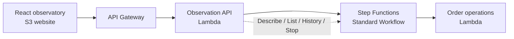
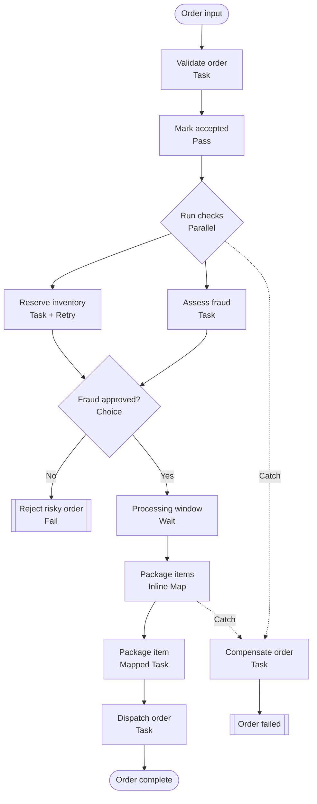

# OrderFlow Observatory — AWS Step Functions with CDK and React

OrderFlow Observatory is an interactive showcase for the AWS Step Functions support in stacksim. It deploys an ordinary CDK v2 application, launches real Standard Workflow executions through an API Lambda, and turns their execution histories into a live React workflow map.

For a guided tour of the interface, every built-in scenario, and the Step
Functions behavior behind each state, see the [OrderFlow Observatory guide](GUIDE.md).

The example is intentionally built around visible orchestration behaviour rather than a CRUD screen. Every scenario changes the path through the same state machine:

- **Happy path** runs parallel checks, maps over three items, and dispatches the order.
- **Retry recovery** makes inventory fail once, waits for the configured backoff, and succeeds on retry.
- **Risk rejection** sends a high fraud score through a Choice state to a terminal failure.
- **Map failure** fails one package iteration and runs the compensation catch path.
- **Observable wait** leaves an execution running long enough to inspect it live or stop it.
- **Custom input** exposes all deterministic failure and timing controls as JSON.

The application uses unmodified `aws-cdk-lib` Step Functions constructs, the ordinary AWS SDK inside Lambda, and standard CloudFormation resources. It has no stacksim-specific constructs or client patches.

## Architecture



CDK deploys two stacks:

| Stack | Contents |
| --- | --- |
| `OrderFlowApplicationStack` | API Gateway, observation API Lambda, workflow worker Lambda, IAM roles/policies, logs, and the Standard state machine |
| `OrderFlowWebStack` | Versioned public S3 website bucket and CDK bucket deployment for the React build |

The deployment script creates the application stack first, rebuilds React with the deployed API identity, and then creates the website stack.

OrderFlow does not configure API Gateway access or execution logging, so its
REST API deliberately sets `cloudWatchRole: false`. It therefore does not
create the regional `AWS::ApiGateway::Account` CloudWatch-role singleton and
can coexist with another example that has already configured that account
setting in the same StackSim data directory.

## Workflow



The inventory task reads `$$.State.RetryCount`, so the retry scenario is deterministic and the successful attempt is visible in the final output. The package map reads `$$.Map.Item.Value` and `$$.Map.Item.Index`, with a maximum concurrency of three.

## Prerequisites

Install:

- Git;
- Node.js 22.13 or newer; and
- npm.

The example pins:

- AWS CDK CLI `2.1132.0`;
- `aws-cdk-lib` `2.265.0`; and
- `constructs` `10.7.1`.

Do not run `cdk bootstrap`. stacksim provides its bounded local bootstrap automatically.

## Install and deploy

Use two terminals. Keep stacksim running in the first terminal while deploying the example from the second.

### 1. Install and start stacksim

Clone or download StackSim, then run these commands from the repository root:

```console
npm ci
npm run build
npm start
```

For an isolated example installation, set a dedicated data directory before starting.

PowerShell:

```powershell
$env:STACKSIM_DATA_DIR = ".stacksim/orderflow-observatory"
npm start
```

macOS or Linux:

```bash
export STACKSIM_DATA_DIR=.stacksim/orderflow-observatory
npm start
```

The default local endpoints are:

| Surface | Default |
| --- | --- |
| AWS SDK and CDK | `http://127.0.0.1:4566` |
| API invocation | `http://127.0.0.1:4567` |
| Region | `eu-west-1` |
| Account | `000000000000` |

### 2. Install and deploy OrderFlow Observatory

From the repository root:

```console
cd examples/cdk-orderflow-observatory
npm ci
```

PowerShell:

```powershell
$env:AWS_ACCESS_KEY_ID = "admin"
$env:AWS_SECRET_ACCESS_KEY = "password"
$env:AWS_REGION = "eu-west-1"
$env:AWS_ENDPOINT_URL = "http://127.0.0.1:4566"
$env:STACKSIM_INVOKE_ENDPOINT = "http://127.0.0.1:4567"
npm run deploy
```

macOS or Linux:

```bash
export AWS_ACCESS_KEY_ID=admin
export AWS_SECRET_ACCESS_KEY=password
export AWS_REGION=eu-west-1
export AWS_ENDPOINT_URL=http://127.0.0.1:4566
export STACKSIM_INVOKE_ENDPOINT=http://127.0.0.1:4567
npm run deploy
```

`npm run deploy`:

1. verifies the local simulator exposes CloudFormation, Step Functions, Lambda, and API Gateway;
2. builds the placeholder React application;
3. synthesizes both CDK stacks;
4. verifies the synthesized workflow and infrastructure contract;
5. deploys the state machine, Lambdas, and API;
6. rebuilds React with the deployed API ID;
7. deploys the S3 website;
8. writes `.runtime/deployment.json`; and
9. runs an end-to-end smoke test.

The final line prints the website URL. The stacks remain deployed so you can inspect their resources and executions.

## Test the example

### Static build and CDK assembly

This does not require a running stacksim instance:

```console
npm run build
```

It builds React, synthesizes the CDK application, and verifies that the assembly contains the expected Standard Workflow, state types, named retry, catch path, API, Lambdas, and website.

### Deployed smoke test

After `npm run deploy`:

```console
npm run smoke
```

The smoke test:

- loads the deployed website and JavaScript;
- reads the deployed state-machine definition through the API;
- starts a transient inventory failure;
- waits for its retry and successful completion;
- verifies history contains two inventory schedules and `ExecutionSucceeded`;
- starts a high-risk order and verifies `OrderRejected`;
- verifies both executions appear in `ListExecutions`; and
- checks browser CORS preflight.

### Manual test

1. Open the website URL printed by `npm run deploy`.
2. Select **Retry recovery** and watch two inventory attempts appear in the timeline.
3. Select **Risk rejection** and inspect the failed output tab.
4. Select **Map failure** and follow the compensation path in the timeline.
5. Select **Observable wait**, confirm the execution remains `RUNNING`, and optionally choose **Stop**.
6. Open the native stacksim Step Functions console at [http://127.0.0.1:4566/#/step-functions/state-machines](http://127.0.0.1:4566/#/step-functions/state-machines) to inspect the same state machine and executions independently.

The deployment manifest at `.runtime/deployment.json` records the website URL, API URL, state-machine ARN, function names, and stack outputs.

## Deterministic input controls

The custom JSON editor accepts:

| Field | Effect |
| --- | --- |
| `fraudScore` | Scores below `70` continue; `70` or higher route to `OrderRejected` |
| `transientFailures` | Number of inventory attempts that throw `InventoryTransientError`; the workflow allows three retries |
| `processingDelaySeconds` | Duration of the Wait state |
| `failInventory` | Throws a non-retried `InventoryUnavailable` error and enters compensation |
| `failItem` | SKU that throws `PackagingError` inside the inline Map |
| `items` | Array mapped concurrently by the package task |

Keep `orderId`, `customer`, and at least one valid item. Invalid input intentionally fails in the validation task.

## Clean up

From `examples/cdk-orderflow-observatory`:

```console
npm run destroy
```

The website bucket uses `RemovalPolicy.RETAIN` so its contents remain available for inspection. Delete that retained local bucket through the stacksim S3 console if you no longer need it.

## Source map

| Path | Purpose |
| --- | --- |
| `app.ts` | Both CDK stacks and the complete Step Functions graph |
| `lambda/worker/index.js` | Deterministic order operations and named failures |
| `lambda/api/index.js` | Start, list, describe, history, and stop API |
| `frontend/src/App.jsx` | Scenario launcher, execution list, workflow map, timeline, and payload inspector |
| `scripts/deploy.mjs` | Repeatable two-stage local deployment |
| `scripts/verify-assembly.mjs` | Synthesized infrastructure contract |
| `scripts/smoke-test.mjs` | Deployed end-to-end verification |

## Intentional boundary

This example stays inside the current P0 Step Functions surface: Standard Workflows, JSONPath data flow, Lambda tasks, retries/catches, Parallel, Inline Map, Wait, execution history, IAM execution roles, and lifecycle APIs. It does not pretend to demonstrate Express Workflows, Distributed Map, callbacks, activities, JSONata, or non-Lambda service integrations.
