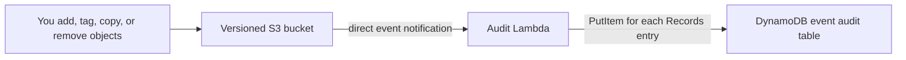

# S3 Lambda Notification Audit — CDK learning example

This small CDK application demonstrates direct Amazon S3 event notifications without an application UI. It creates an empty versioned S3 bucket, sends its events to one Lambda function, and stores readable event records in DynamoDB.

The code favors explicit names and comments over abstraction. Start with [`app.ts`](app.ts), then read [`lambda/audit-record.mjs`](lambda/audit-record.mjs) and [`lambda/index.mjs`](lambda/index.mjs).

## Architecture



The Lambda is a direct destination in the bucket's native CloudFormation `NotificationConfiguration`, so it appears in the S3 console's **Event notifications** panel.

## What the notification selects

The bucket selects every wildcard event family available in StackSim's event notification panel:

- `s3:ObjectCreated:*`
- `s3:ObjectRemoved:*`
- `s3:ObjectRestore:*`
- `s3:ObjectTagging:*`
- `s3:ObjectAcl:Put`
- `s3:ObjectAnnotation:*`
- `s3:LifecycleExpiration:*`
- `s3:LifecycleTransition`

There are no prefix or suffix filters, so events for every object key can invoke the Lambda. Wildcard families include their specific operations—for example, `s3:ObjectCreated:*` includes PUT, POST, COPY, and completed multipart uploads.

The Lambda does not switch on a fixed list of event names. It promotes common fields into readable DynamoDB attributes and stores the complete record and invocation JSON. If the event payload gains unfamiliar fields, they remain available in `rawRecordJson` and `rawEventJson`.

S3 tagging notifications identify the object whose tags changed, but the AWS event payload does not include the tag keys or values. For `s3:ObjectTagging:Put`, the Lambda therefore calls `GetObjectTagging` for the event's object version and adds the observed tag set to the audit item. For `s3:ObjectTagging:Delete`, it records an empty tag set. This follow-up read is an observation of current state: if another tag update happens before the Lambda runs, the audit item can contain the newer tag set.

## Resources

The `S3LambdaNotificationAuditStack` provisions:

| Resource | Purpose |
| --- | --- |
| Versioned S3 bucket | Starts empty and produces direct event notifications. Versioning makes version IDs and delete markers visible. |
| Lambda function | Handles the S3 `Records[]` envelope and converts every record into an audit item. |
| DynamoDB table | Stores one time-ordered history partition per bucket. |
| Lambda resource permission | Allows `s3.amazonaws.com` to invoke the function only from the learning bucket and account. |
| Lambda execution permission | Allows the audit function to read tags from objects in the learning bucket for tagging-event enrichment. |

The DynamoDB key is:

- `bucketName` — partition key;
- `eventKey` — sort key containing the event time, sequencer or request ID, and record index.

Useful attributes include `eventName`, `configurationId`, `objectKey`, `objectSize`, `objectETag`, `objectVersionId`, `sequencer`, `deleteMarker`, request details, `summary`, `rawRecordJson`, and `rawEventJson`. Tagging records also include `objectTags`, `objectTagCount`, `objectTagsObservedAt`, and `objectTagsSource` (or `objectTagsLookupError` if enrichment was not possible).

S3 sends a differently shaped `s3:TestEvent` when the notification is saved. The Lambda handles and stores that event too, so the first table item proves that destination validation reached the function.

## Prerequisites

- Node.js 22.13 or newer;
- npm;
- a running StackSim installation, or an AWS account configured for CDK;
- optionally, AWS CLI v2 for manual testing.

The example pins the same CDK versions as this repository. Do not run `cdk bootstrap` for StackSim; its local CDK bootstrap is managed automatically. A real AWS account must be bootstrapped normally before its first CDK deployment.

## Build

From the repository root:

```console
cd examples/cdk-s3-lambda-notification-audit
npm ci
npm run build
```

`npm run build` type-checks the stack, runs the mapper unit tests, synthesizes the CDK application, and verifies the infrastructure contract. The checks specifically require exactly one S3 bucket, one application Lambda, one DynamoDB table, a direct bucket notification configuration, and the S3 service-principal permission.

## Deploy to StackSim

Use two terminals.

### 1. Start StackSim

From the repository root in the first terminal:

```console
npm ci
npm run build
npm start
```

The default SDK/CDK endpoint is `http://127.0.0.1:4566`.

### 2. Deploy the example

From `examples/cdk-s3-lambda-notification-audit` in the second terminal:

```bash
export AWS_ACCESS_KEY_ID=admin
export AWS_SECRET_ACCESS_KEY=password
export AWS_REGION=eu-west-1
export AWS_DEFAULT_REGION=eu-west-1
export AWS_ENDPOINT_URL=http://127.0.0.1:4566
export CDK_DEFAULT_ACCOUNT=000000000000
export CDK_DEFAULT_REGION=eu-west-1

npm run deploy
```

PowerShell uses the equivalent `$env:NAME = "value"` assignments.

CDK prints the generated bucket, table, and function names. It also saves them in `.runtime/outputs.json` for the included command-line scripts. The bucket is empty immediately after deployment.

## Verify the notification in the console

Open the generated bucket and select its **Permissions** tab. The **Event notifications** panel should show eight direct notification rows. Each row uses the same destination Lambda and selects one event pattern:

| Field | Expected value |
| --- | --- |
| Configuration IDs | `cloudformation-1` through `cloudformation-8` in StackSim |
| Destination | The generated `EventAuditFunction...` Lambda ARN |
| Events | The eight event patterns listed above |
| Prefix / suffix | Empty |

## Quick end-to-end test

Run:

```console
npm run demo
```

The demo uploads an object, adds tags, removes its tags, and deletes it. It waits for direct S3 delivery and prints rows similar to:

| Event name |
| --- |
| `s3:ObjectCreated:Put` |
| `s3:ObjectTagging:Put` (with the observed `lesson` and `stage` tags) |
| `s3:ObjectTagging:Delete` |
| `s3:ObjectRemoved:DeleteMarkerCreated` |

Direct S3 notification delivery is at least once, so duplicate deliveries are possible. The table key uses stable event information so a retry of the same record overwrites the same item.

## Test with your own files and tags

Read `BucketName` from the deployment output, then use ordinary AWS CLI commands:

```bash
export BUCKET_NAME="replace-with-the-output-bucket-name"

echo "learning S3 notifications" > /tmp/s3-notification-learning.txt
aws --endpoint-url "$AWS_ENDPOINT_URL" s3 cp \
  /tmp/s3-notification-learning.txt \
  "s3://$BUCKET_NAME/lessons/first.txt"

aws --endpoint-url "$AWS_ENDPOINT_URL" s3api put-object-tagging \
  --bucket "$BUCKET_NAME" \
  --key lessons/first.txt \
  --tagging 'TagSet=[{Key=course,Value=s3},{Key=stage,Value=learning}]'

aws --endpoint-url "$AWS_ENDPOINT_URL" s3api delete-object-tagging \
  --bucket "$BUCKET_NAME" \
  --key lessons/first.txt

aws --endpoint-url "$AWS_ENDPOINT_URL" s3 rm \
  "s3://$BUCKET_NAME/lessons/first.txt"
```

Print every audit record without using an application UI:

```console
npm run show-events
```

You can repeat these operations with different keys, copies, multipart uploads, ACL changes, lifecycle transitions, archive restores, and object annotations supported by StackSim.

## Deploy to AWS instead

Unset `AWS_ENDPOINT_URL`, select your AWS profile and Region, bootstrap the account if necessary, and use the same deployment command:

```bash
unset AWS_ENDPOINT_URL
export AWS_PROFILE=your-profile
export AWS_REGION=eu-west-1
export CDK_DEFAULT_ACCOUNT="$(aws sts get-caller-identity --query Account --output text)"
export CDK_DEFAULT_REGION="$AWS_REGION"

npx cdk bootstrap "aws://$CDK_DEFAULT_ACCOUNT/$CDK_DEFAULT_REGION"
npm run deploy
```

## Clean up

The table, Lambda, permission, and notification configuration use normal stack deletion behavior:

```console
npm run destroy
```

The learning bucket deliberately uses `RemovalPolicy.RETAIN`. This prevents stack deletion from unexpectedly erasing files you added. Because the retained bucket keeps its notification configuration, delete the notification rows and all object versions before deleting the bucket manually when you no longer need it.

## Source map

| Path | Purpose |
| --- | --- |
| `app.ts` | Complete CDK stack and explanatory infrastructure comments. |
| `lambda/index.mjs` | Lambda entry point and DynamoDB writes. |
| `lambda/audit-record.mjs` | Generic direct S3 record-to-item conversion. |
| `test/audit-record.test.mjs` | Known, unfamiliar, and S3 test-event conversion examples. |
| `scripts/demo.mjs` | Creates, tags, untags, and deletes one object, then verifies records. |
| `scripts/show-events.mjs` | Prints the DynamoDB audit history in the terminal. |
| `scripts/verify-assembly.mjs` | Checks the synthesized infrastructure contract. |

## Intentional boundaries

- There is no application UI.
- The notification has no object-key filters.
- The example configures every event family currently exposed by StackSim's notification panel. Replication, Intelligent-Tiering archival, and Reduced Redundancy lost-object events are not produced by StackSim's current S3 profile.
- DynamoDB `Scan` is used only by the small teaching scripts.
- The retained bucket favors safe learning over one-command cleanup.
