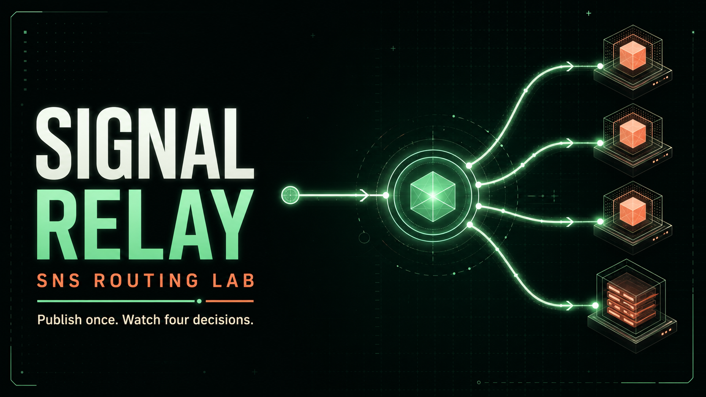

# Signal Relay — Amazon SNS Routing Lab

Signal Relay is an interactive tutorial application that demonstrates what Amazon Simple Notification Service does in a real application. It is deployed entirely through ordinary AWS CDK v2 constructs to stacksim.

The central idea is deliberately simple:

> The producer publishes an incident once. SNS decides which subscribers receive it.

The application makes those otherwise invisible routing decisions visible. Publish an incident and the routing map shows each subscription as **Delivered**, **Filtered out**, or briefly **In flight**.



## What you will learn

By deploying and using this example, you will see:

- a Standard SNS topic created through CDK;
- three Lambda subscriptions and one SQS subscription;
- message-attribute filtering;
- nested JSON message-body filtering;
- independent fan-out to multiple matching subscriptions;
- the SNS event envelope delivered to Lambda;
- raw-message delivery to SQS;
- subscription redrive policies and a shared dead-letter queue;
- topic and queue resource policies generated by CDK;
- least-privilege Lambda execution policies;
- an API that calls the ordinary AWS SDK `Publish` operation once;
- deterministic data seeded through the deployed application;
- a React tutorial UI hosted from an S3 website; and
- CloudFormation outputs, updates, and deletion behaviour.

The application uses no stacksim-specific CDK constructs, patched clients, or invented SNS operations.

The REST API does not enable API Gateway access or execution logging, so it
sets `cloudWatchRole: false`. This prevents the stack from creating the
regional `AWS::ApiGateway::Account` CloudWatch-role singleton and allows the
lab to coexist with other examples deployed to the same StackSim region. The
application still creates CloudWatch log groups for its Lambda functions.

## Architecture

```text
Browser
  │
  ├── website assets ───────────────────────> S3 website
  │
  └── GET/POST incidents ──────────────────> API Gateway
                                                  │
                                           Publisher Lambda
                                                  │
                                           one SNS Publish
                                                  │
                                  ┌───────────────┴───────────────┐
                                  │       Standard SNS topic      │
                                  │  filters + independent fanout │
                                  └───────────────┬───────────────┘
                                                  │
                 ┌────────────────────┬───────────┼────────────────────┐
                 │                    │           │                    │
       severity = critical   body service =   environment =        no filter
                 │              payments       production              │
                 ▼                    ▼           ▼                    ▼
       Critical responder     Payments triage  Production watch    raw SQS audit
             Lambda               Lambda           Lambda              queue
                 │                    │              │                    │
                 └────────────────────┴──────────────┴──────────┬─────────┘
                                                               ▼
                                                    DynamoDB delivery evidence
```

SNS is the decision point. SQS is used for only one subscriber so the tutorial can compare Lambda's SNS envelope with raw queue delivery.

## The four subscriptions

| Subscription | Protocol | Filter scope | Filter | Delivery |
| --- | --- | --- | --- | --- |
| Critical response | Lambda | Message attributes | `severity = critical` | `Records[].Sns` envelope |
| Payments triage | Lambda | Message body | `detail.service = payments` | `Records[].Sns` envelope |
| Production watch | Lambda | Message attributes | `environment = production` | `Records[].Sns` envelope |
| Audit archive | SQS | None | All messages | Raw JSON body |

Every subscription has a redrive policy pointing at the shared subscription dead-letter queue. Normal tutorial messages do not fail, so the DLQ should remain empty.

## Seeded learning data

Deployment publishes six deterministic incidents through the deployed API. They are not inserted directly into the delivery table.

| Incident | Critical response | Payments triage | Production watch | Audit archive |
| --- | --- | --- | --- | --- |
| Checkout authorization failures | Delivered | Delivered | Delivered | Delivered |
| Payment latency elevated | Filtered | Delivered | Delivered | Delivered |
| Search index lag | Filtered | Filtered | Delivered | Delivered |
| Staging token validation errors | Delivered | Filtered | Filtered | Delivered |
| Development preview unavailable | Filtered | Filtered | Filtered | Delivered |
| Payment sandbox regression | Delivered | Delivered | Filtered | Delivered |

That produces fifteen deliveries and nine filtered decisions from six calls to `Publish`.

## Prerequisites

Install:

- Git;
- Node.js 22.13 or newer; and
- npm.

The example uses the versions pinned by this repository:

- AWS CDK CLI `2.1132.0`;
- `aws-cdk-lib` `2.261.0`; and
- `constructs` `10.7.1`.

Do not run `cdk bootstrap`. stacksim provides its bounded local CDK bootstrap automatically.

## Install and deploy from a fresh checkout

Use two terminals. Keep stacksim running in the first while deploying from the second.

### Terminal 1: install and start stacksim

Clone or download StackSim, then run these commands from the repository root:

```console
npm ci
npm run build
```

Start the simulator:

```console
npm start
```

The defaults used by this tutorial are:

| Surface | Default |
| --- | --- |
| SDK and CDK endpoint | `http://127.0.0.1:4566` |
| API invocation endpoint | `http://127.0.0.1:4567` |
| Region | `eu-west-1` |
| Account | `000000000000` |
| Access key ID | `admin` |
| Secret access key | `password` |

For an isolated tutorial installation, set a dedicated data directory before every start.

PowerShell:

```powershell
$env:STACKSIM_DATA_DIR = ".stacksim/sns-routing-lab"
npm start
```

macOS or Linux:

```bash
export STACKSIM_DATA_DIR=.stacksim/sns-routing-lab
npm start
```

Using a different data directory later opens a different simulator installation. Deploy again if you intentionally change it.

### Terminal 2: install and deploy Signal Relay

From the repository root:

```console
cd examples/cdk-sns-routing-lab
npm ci
```

Set the ordinary AWS environment used by CDK.

PowerShell:

```powershell
$env:AWS_ACCESS_KEY_ID = "admin"
$env:AWS_SECRET_ACCESS_KEY = "password"
$env:AWS_REGION = "eu-west-1"
$env:AWS_ENDPOINT_URL = "http://127.0.0.1:4566"
$env:STACKSIM_INVOKE_ENDPOINT = "http://127.0.0.1:4567"
npm run deploy
```

macOS or Linux:

```bash
export AWS_ACCESS_KEY_ID=admin
export AWS_SECRET_ACCESS_KEY=password
export AWS_REGION=eu-west-1
export AWS_ENDPOINT_URL=http://127.0.0.1:4566
export STACKSIM_INVOKE_ENDPOINT=http://127.0.0.1:4567
npm run deploy
```

`npm run deploy` performs the complete tutorial setup:

1. checks that stacksim exposes SNS and CloudFormation;
2. builds a placeholder frontend;
3. synthesizes all three CDK stacks;
4. verifies the exact resource and SNS subscription contract;
5. deploys the DynamoDB and application stacks;
6. publishes the six deterministic seed incidents through the live API;
7. rebuilds React with the deployed API identity;
8. deploys the S3 website stack;
9. writes `.runtime/deployment.json`; and
10. runs an end-to-end smoke test.

The final line prints the local website URL. Open it in a browser.

## Using the tutorial

### 1. Start with a seeded journey

Select **Checkout authorization failures**. It is:

- critical;
- owned by the payments service; and
- in production.

All four subscriptions therefore match.

Compare it with **Development preview unavailable**. Only the unfiltered audit subscription receives that message. The other three cards are marked **Filtered out**.

### 2. Publish your own incident

Use the form at the top of the page:

1. enter a title and summary;
2. choose severity, service, and environment;
3. select **Publish once to SNS**; and
4. watch the subscription cards settle.

The producer does not call any subscriber directly. Its only destination is the topic ARN.

### 3. Predict the routing result

Before publishing, predict which subscriptions will match:

- `critical` activates Critical response;
- `payments` activates Payments triage;
- `production` activates Production watch; and
- Audit archive always matches.

Try `critical + payments + production` to activate everything, then `low + storefront + development` to activate only Audit archive.

### 4. Inspect the AWS resources

Open the stacksim console at:

```text
http://127.0.0.1:4566/_stacksim/console
```

Useful inspection points:

- **CloudFormation:** the three stacks and their outputs;
- **Amazon SNS:** the topic, subscriptions, filter policies, raw delivery and redrive settings;
- **Lambda:** the publisher and three subscriber functions;
- **SQS:** the audit queue, queue policy and subscription DLQ;
- **DynamoDB:** incident and delivery-observation tables;
- **API Gateway:** the REST resources and methods; and
- **CloudWatch Logs:** subscriber, audit-worker and publisher Lambda logs.

## Follow the code

The learning path through the source is:

1. [`app.ts`](app.ts) creates the topic and subscriptions.
2. [`lambda/api/index.js`](lambda/api/index.js) constructs one JSON message and calls `Publish`.
3. [`lambda/subscriber/index.js`](lambda/subscriber/index.js) reads the Lambda `Records[].Sns` envelope.
4. [`lambda/audit-worker/index.js`](lambda/audit-worker/index.js) reads the raw message from SQS.
5. [`frontend/src/App.jsx`](frontend/src/App.jsx) visualizes matches and delivery evidence.
6. [`scripts/smoke-test.mjs`](scripts/smoke-test.mjs) proves the seeded routing matrix.

The publisher attaches:

```js
MessageAttributes: {
  severity: { DataType: "String", StringValue: checked.severity },
  service: { DataType: "String", StringValue: checked.service },
  environment: { DataType: "String", StringValue: checked.environment },
}
```

The critical subscriber uses an attribute filter:

```ts
filterPolicy: {
  severity: sns.SubscriptionFilter.stringFilter({
    allowlist: ["critical"],
  }),
}
```

The payments subscriber instead reads nested JSON:

```ts
filterPolicyWithMessageBody: {
  detail: sns.FilterOrPolicy.policy({
    service: sns.FilterOrPolicy.filter(
      sns.SubscriptionFilter.stringFilter({
        allowlist: ["payments"],
      }),
    ),
  }),
}
```

These filters are evaluated by SNS. They are not reimplemented in the subscriber functions.

## Useful commands

From `examples/cdk-sns-routing-lab`:

```console
npm run build
```

Builds React, synthesizes CDK, and verifies the exact assembly.

```console
npm run synth
```

Synthesizes the three CloudFormation templates without deploying.

```console
npm run verify:assembly
```

Checks the resource-type set and the important SNS properties.

```console
npm run seed
```

Idempotently ensures that the six tutorial incidents exist. It requires a previous successful deployment.

```console
npm run smoke
```

Checks the deployed website, API, CORS, topic identity, filter scopes, seeded routing matrix and raw audit delivery.

```console
npm run destroy
```

Destroys the three application stacks. Use the same endpoint, Region and credentials used for deployment.

## Make a change and redeploy

Good exercises:

1. Add `"high"` to the Critical response allowlist.
2. Change Payments triage to match both `payments` and `identity`.
3. Add a second field to the production filter.
4. Change the audit subscription from raw delivery to the standard SNS envelope and update its worker.
5. Add another Lambda subscription for `environment = staging`.

After changing `app.ts`, run:

```console
npm run build
npm run deploy
```

The assembly verifier intentionally fails if a change unexpectedly adds a new CloudFormation resource type or removes an important SNS setting. Update the verifier only when the tutorial contract is intentionally changing.

## Cleanup and retained resources

The DynamoDB tables, SNS topic, subscriptions, queues, Lambdas, API and their policies use normal delete behaviour.

The website bucket uses `RemovalPolicy.RETAIN` because it contains versioned objects. `npm run destroy` removes the website policy and stack ownership but intentionally leaves the bucket and its content for inspection. Delete or empty that retained tutorial bucket separately when it is no longer needed.

The simulator-managed CDK bootstrap bucket and its roles also persist. Do not attempt to remove them as part of this example.

## Current compatibility boundary

This tutorial intentionally stays inside SNS-01 through SNS-03:

- Standard topics only;
- SQS and Lambda subscriptions only;
- message-attribute and message-body filter policies;
- raw SQS delivery;
- subscription redrive policies;
- topic policies; and
- the supported `AWS::SNS::Topic`, `AWS::SNS::Subscription`, and `AWS::SNS::TopicPolicy` CDK output.

It does not demonstrate:

- FIFO topics;
- archive or replay;
- email, SMS, mobile push, HTTP/S, or Firehose subscriptions;
- KMS-backed topics;
- cross-account or cross-Region subscriptions; or
- production AWS network delivery.

Those boundaries are deliberate. Unsupported CDK properties fail deployment instead of being silently accepted.

## Troubleshooting

### stacksim is not reachable

Keep Terminal 1 running. Confirm:

```text
http://127.0.0.1:4566/_stacksim/health
```

If you changed `STACKSIM_PORT`, update `AWS_ENDPOINT_URL`.

### The website loads but the API is unavailable

The browser calls the invocation listener, not the control-plane listener. The default is port `4567`. Confirm that `STACKSIM_INVOKE_ENDPOINT` matched the running simulator when you deployed, then rerun `npm run deploy`.

### The console appears empty after a restart

Confirm that the simulator is using the same `STACKSIM_DATA_DIR` as the deployment. Resources are persistent, but each data directory is a separate installation.

### CDK reports unsupported properties

Use the pinned dependencies from this directory and run `npm ci`. A different CDK release can synthesize a different helper graph or property set.

### A journey remains in flight

Wait a few seconds and use the refresh button. Then inspect the relevant Lambda logs, its resource permission, the subscription filter and the subscription DLQ. `npm run smoke` reports unresolved seeded deliveries directly.

### Seed reports zero new incidents

That is expected after the first deployment. Seeding is idempotent. Existing seed IDs are not republished.

## Tutorial presentation

For a short guided demonstration, use [SHOWCASE-GUIDE.md](SHOWCASE-GUIDE.md).
